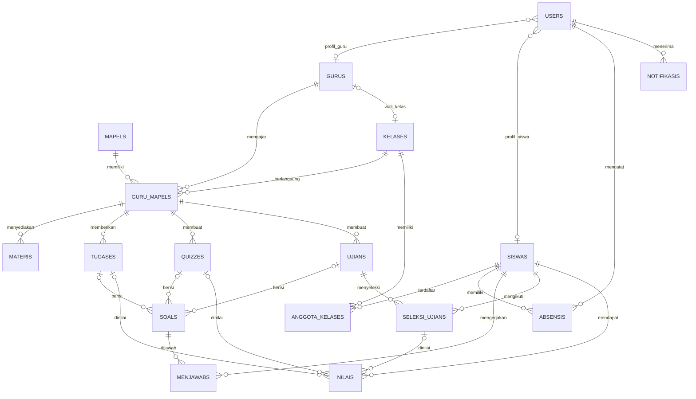

<p align="center"><a href="https://laravel.com" target="_blank"></a></p>

<p align="center">
<a href="https://github.com/laravel/framework/actions"></a>
<a href="https://packagist.org/packages/laravel/framework"></a>
<a href="https://packagist.org/packages/laravel/framework"></a>
<a href="https://packagist.org/packages/laravel/framework"></a>
</p>

## About Laravel

Laravel is a web application framework with expressive, elegant syntax. We believe development must be an enjoyable and creative experience to be truly fulfilling. Laravel takes the pain out of development by easing common tasks used in many web projects, such as:

- [Simple, fast routing engine](https://laravel.com/docs/routing).
- [Powerful dependency injection container](https://laravel.com/docs/container).
- Multiple back-ends for [session](https://laravel.com/docs/session) and [cache](https://laravel.com/docs/cache) storage.
- Expressive, intuitive [database ORM](https://laravel.com/docs/eloquent).
- Database agnostic [schema migrations](https://laravel.com/docs/migrations).
- [Robust background job processing](https://laravel.com/docs/queues).
- [Real-time event broadcasting](https://laravel.com/docs/broadcasting).

Laravel is accessible, powerful, and provides tools required for large, robust applications.

## Learning Laravel

Laravel has the most extensive and thorough [documentation](https://laravel.com/docs) and video tutorial library of all modern web application frameworks, making it a breeze to get started with the framework.

In addition, [Laracasts](https://laracasts.com) contains thousands of video tutorials on a range of topics including Laravel, modern PHP, unit testing, and JavaScript. Boost your skills by digging into our comprehensive video library.

You can also watch bite-sized lessons with real-world projects on [Laravel Learn](https://laravel.com/learn), where you will be guided through building a Laravel application from scratch while learning PHP fundamentals.

## Agentic Development

Laravel's predictable structure and conventions make it ideal for AI coding agents like Claude Code, Cursor, and GitHub Copilot. Install [Laravel Boost](https://laravel.com/docs/ai) to supercharge your AI workflow:

```bash
composer require laravel/boost --dev

php artisan boost:install
```

Boost provides your agent 15+ tools and skills that help agents build Laravel applications while following best practices.

## Contributing

Thank you for considering contributing to the Laravel framework! The contribution guide can be found in the [Laravel documentation](https://laravel.com/docs/contributions).

## Code of Conduct

In order to ensure that the Laravel community is welcoming to all, please review and abide by the [Code of Conduct](https://laravel.com/docs/contributions#code-of-conduct).

## Security Vulnerabilities

If you discover a security vulnerability within Laravel, please send an e-mail to Taylor Otwell via [taylor@laravel.com](mailto:taylor@laravel.com). All security vulnerabilities will be promptly addressed.

## License

The Laravel framework is open-sourced software licensed under the [MIT license](https://opensource.org/licenses/MIT).

# LearnPoint

LearnPoint adalah aplikasi pembelajaran sekolah berbasis Laravel. README ini mendokumentasikan struktur database berdasarkan seluruh migration pada `database/migrations`, bukan hasil introspeksi database runtime.

## Ringkasan Skema

Skema terdiri dari empat area utama:

1. **Akun dan profil**: `users`, `gurus`, `siswas`.
2. **Akademik**: `kelases`, `anggota_kelases`, `mapels`, `guru_mapels`.
3. **Pembelajaran dan penilaian**: `materis`, `tugases`, `quizzes`, `ujians`, `soals`, `menjawabs`, `seleksi_ujians`, `nilais`.
4. **Operasional Laravel**: `password_reset_tokens`, `sessions`, `cache`, `cache_locks`, `jobs`, `job_batches`, `failed_jobs`, dan `notifikasis`.

## Diagram Relasi



## Tabel Domain

### Akun dan profil

| Tabel | Kolom penting | Constraint dan fungsi |
| --- | --- | --- |
| `users` | `name`, `email`, `password`, `username`, `role`, `status`, `guru_id`, `siswa_id` | `email` dan `username` unik. `role`: `siswa`, `guru`, `operator`, `kepala_sekolah`. `status`: `aktif`/`nonaktif`. Link profil nullable ke `gurus` dan `siswas`, di-null-kan saat profil dihapus. |
| `gurus` | `nama`, `nip`, `status` | `status`: `aktif`/`nonaktif`, default `aktif`. |
| `siswas` | `nama_siswa`, `nis`, `alamat`, `tanggal_lahir`, `jenis_kelamin`, `wali_murid`, `nohp_wali`, `status` | `jenis_kelamin`: `L`/`P`. Keanggotaan kelas disimpan di `anggota_kelases`. |

### Akademik

| Tabel | Kolom penting | Constraint dan fungsi |
| --- | --- | --- |
| `kelases` | `nama_kelas`, `tingkatan`, `jadwal`, `guru_id` | `guru_id` nullable, unik, dan mengarah ke wali kelas. Dihapus menjadi null jika guru dihapus. |
| `anggota_kelases` | `kelas_id`, `siswa_id`, `tahun_ajaran`, `semester` | Pivot riwayat keanggotaan. `semester`: `ganjil`/`genap`; default tahun ajaran `2026/2027`; kombinasi empat kolom unik. |
| `mapels` | `nama_mapel`, `kkm` | Data mata pelajaran dan nilai ketuntasan minimal. |
| `guru_mapels` | `guru_id`, `mapel_id`, `kelas_id`, `jadwal` | Penugasan guru-mapel-kelas. Kombinasi tiga foreign key unik; semua relasi cascade saat induk dihapus. |

### Pembelajaran dan penilaian

| Tabel | Kolom penting | Constraint dan fungsi |
| --- | --- | --- |
| `materis` | `judul`, `file_materi`, `guru_mapel_id` | Materi terkait satu penugasan guru-mapel-kelas. |
| `tugases` | `judul`, `deadline`, `tipe`, `guru_mapel_id` | `tipe`: `upload` atau `pilihan_ganda`. |
| `quizzes` | `judul`, `level`, `kesulitan`, `guru_mapel_id` | Kuis terkait penugasan guru-mapel-kelas. |
| `ujians` | `judul`, `deskripsi`, `waktu_mulai`, `deadline`, `durasi_menit`, `guru_mapel_id` | `durasi_menit` unsigned, default 60; `deskripsi` dan `waktu_mulai` nullable. |
| `soals` | `pertanyaan`, `pilihan`, `kunci_jawaban`, `quiz_id`, `tugas_id`, `ujian_id` | Ketiga relasi aktivitas nullable, tetapi database mewajibkan tepat satu FK terisi. |
| `menjawabs` | `soal_id`, `siswa_id`, `jawaban_dipilih`, `benar` | Jawaban siswa untuk sebuah soal. |
| `seleksi_ujians` | `siswa_id`, `ujian_id`, `nilai_awal`, `jumlah_remidi`, `nilai_akhir` | Relasi peserta ujian dan riwayat remidi; `jumlah_remidi` default 0. |
| `nilais` | `nilai`, `status`, `durasi`, `file_jawaban`, `siswa_id`, `tugas_id`, `quiz_id`, `seleksi_ujian_id` | `status`: `telat`/`selesai`. Satu nilai dapat merujuk ke tugas, quiz, atau seleksi ujian. |
| `absensis` | `tanggal`, `keterangan`, `siswa_id`, `user_id` | `keterangan`: `hadir`, `izin`, `sakit`, `alpa`; pencatat (`user_id`) nullable. |
| `notifikasis` | `judul`, `pesan`, `id_referensi`, `user_id` | Notifikasi milik user. `id_referensi` hanya unsigned bigint nullable, tanpa foreign key eksplisit. |

## Tabel Infrastruktur Laravel

- `password_reset_tokens`: token reset password dengan `email` sebagai primary key.
- `sessions`: sesi login; `user_id` hanya indexed dan **tidak** memiliki foreign key migration.
- `cache` dan `cache_locks`: penyimpanan cache database.
- `jobs`, `job_batches`, dan `failed_jobs`: antrean pekerjaan dan pencatatan job gagal.

## Urutan Evolusi Migration

1. Migration bawaan membuat `users`, token password, session, cache, dan jobs.
2. Migration 17 September 2026 membuat profil `gurus`, `kelases`, dan `siswas`, lalu menambahkan role serta link profil ke `users`.
3. Migration 18 September membuat `mapels`, absensi, penugasan guru-mapel, materi, tugas, quiz, ujian, soal, jawaban, seleksi ujian, nilai, dan notifikasi.
4. Migration 21 September menambahkan pivot `anggota_kelases` dan kolom `jadwal` pada `guru_mapels`.
5. Migration 22 September menambahkan `status` pada `users`.
6. Migration 23 September memindahkan `jadwal` dari `anggota_kelases` ke `kelases` dan menyalin data jadwal yang sudah ada.
7. Migration 24 September menambahkan `status` pada `gurus` dan `siswas`.
8. Migration 25 September membuat `kelas_pengampus`, yang saat ini hanya memiliki `id` dan timestamps serta belum memiliki relasi atau kolom domain.
9. Migration lanjutan 25 September menghapus `siswas.kelas_id` dan menambahkan validasi tepat satu FK aktivitas pada `soals`.

## Laporan File Migration yang Diubah

Berdasarkan perubahan pada working tree saat dokumentasi ini dibuat, terdapat dua file migration baru. Tidak ada migration lama yang diedit atau dihapus.

| File migration | Perubahan |
| --- | --- |
| [`2026_09_25_030000_remove_kelas_id_from_siswas_and_validate_soals.php`](database/migrations/2026_09_25_030000_remove_kelas_id_from_siswas_and_validate_soals.php) | Menghapus kolom dan foreign key `siswas.kelas_id`; hubungan siswa-kelas dilanjutkan melalui `anggota_kelases`. Pada database non-SQLite, menambahkan `soals_exactly_one_activity_fk` agar tepat satu dari `quiz_id`, `tugas_id`, atau `ujian_id` terisi. |
| [`2026_09_25_034950_add_unique_to_nip_in_gurus.php`](database/migrations/2026_09_25_034950_add_unique_to_nip_in_gurus.php) | Mengubah `gurus.nip` menjadi string maksimal 18 karakter dan menambahkan unique constraint agar NIP guru tidak boleh duplikat. |

Migration yang menjadi dasar analisis skema, tetapi tidak mengalami perubahan pada working tree, tetap berada di `database/migrations` dan tercatat pada bagian [Urutan Evolusi Migration](#urutan-evolusi-migration).

## Catatan Integritas Skema

- **Kepemilikan kelas:** `kelases.guru_id` unik, sehingga seorang guru hanya dapat menjadi wali untuk satu kelas melalui kolom ini. Penugasan mengajar yang lebih umum tetap menggunakan `guru_mapels`.
- **Keanggotaan siswa:** `siswas.kelas_id` telah dihapus. Seluruh hubungan siswa-kelas dan riwayat tahun ajaran/semester disimpan di `anggota_kelases`.
- **Soal:** `soals` memiliki database check constraint `soals_exactly_one_activity_fk`, sehingga tepat satu dari `quiz_id`, `tugas_id`, dan `ujian_id` harus terisi. Validasi request tetap disarankan agar pesan error ramah pengguna.
- **Nilai:** pola tiga foreign key nullable pada `nilais` juga tidak memaksa tepat satu sumber penilaian. Tambahkan validasi agar satu baris tidak merujuk ke beberapa aktivitas sekaligus.
- **Duplikasi data siswa:** belum ada constraint unik pada `nis`. `gurus.nip` sudah memiliki unique constraint melalui migration `2026_09_25_034950_add_unique_to_nip_in_gurus.php`.
- **Arah penghapusan:** sebagian besar tabel pembelajaran memakai cascade, sedangkan link profil pada `users` dan `kelases.guru_id` memakai `nullOnDelete`.
- **`kelas_pengampus`:** tabel ini masih berupa placeholder dan belum terhubung ke tabel lain.

## Perintah Database

```bash
php artisan migrate
php artisan migrate:status
php artisan migrate:rollback
```

Jalankan migration pada database pengembangan yang dapat di-reset. Migration pemindahan jadwal memindahkan data dari `anggota_kelases.jadwal` ke `kelases.jadwal`, sehingga backup tetap disarankan sebelum rollback atau deployment.
